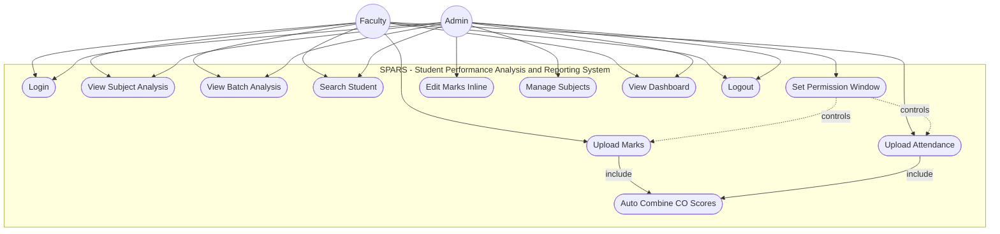
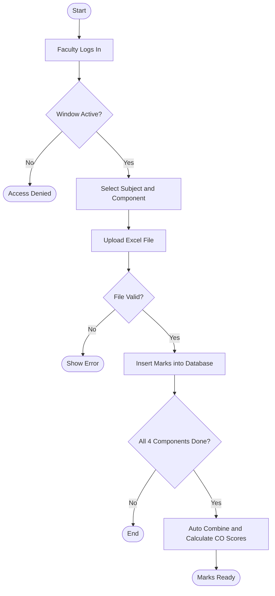
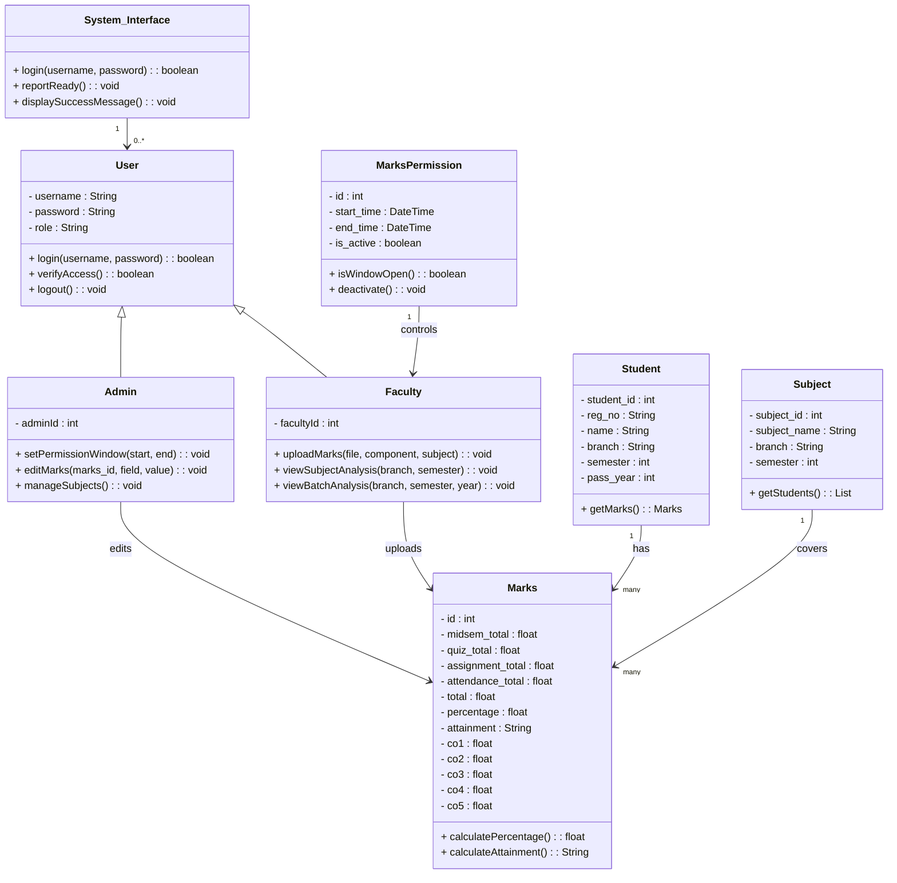
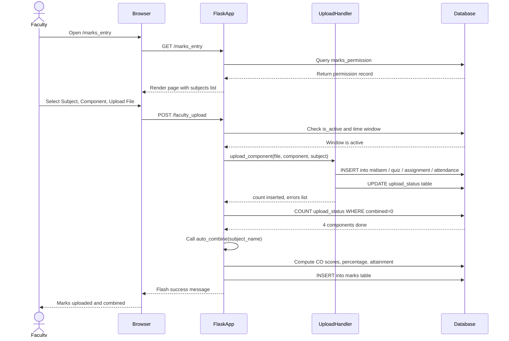
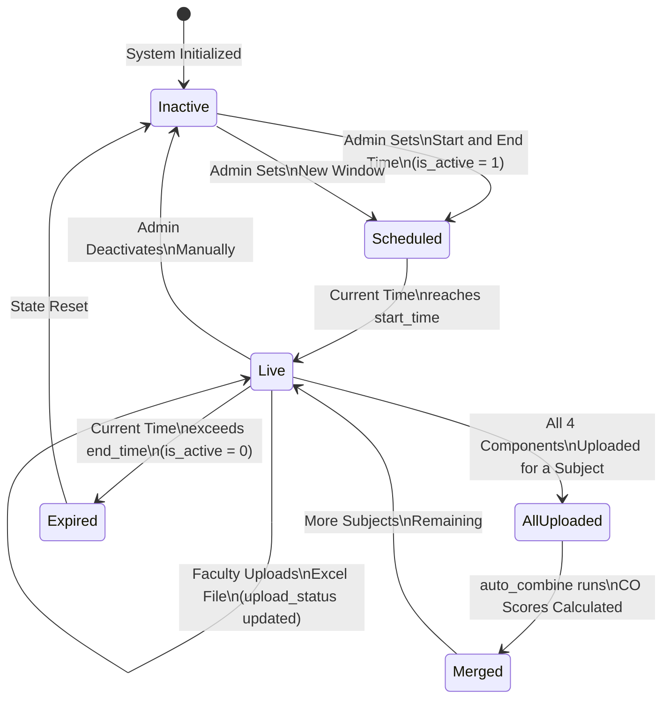
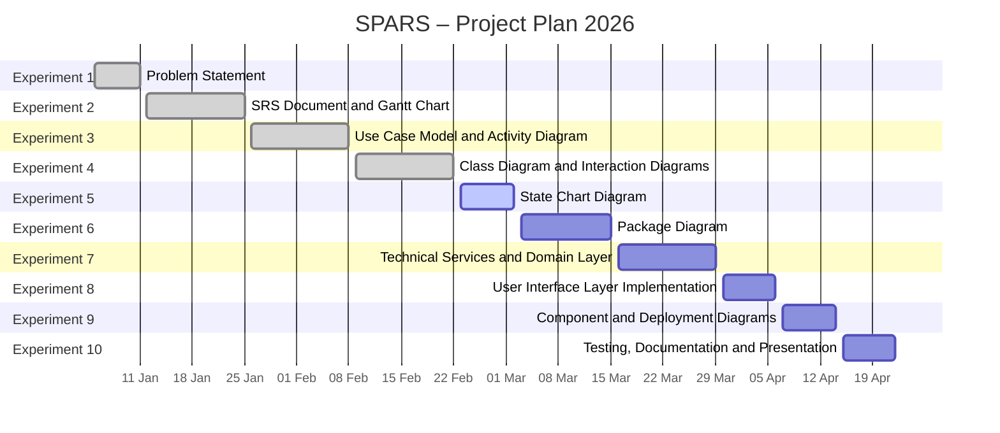

# SPARS – UML Diagrams (Experiments 3 to 6) + Gantt Chart
# Student Performance Analysis and Reporting System

---

## EXPERIMENT 3(i) — Use Case Diagram



---

## EXPERIMENT 3(ii) — Activity Diagram (Upload Marks Flow)



---

## EXPERIMENT 4(i) — Class Diagram



---

## EXPERIMENT 4(ii) — Sequence Diagram (Faculty Uploads Marks)



---

## EXPERIMENT 5 — State Chart Diagram (Marks Permission Lifecycle)



---

## EXPERIMENT 6 — Package Diagram (Layered Architecture)

```mermaid
graph TD
    subgraph UI["UI Layer — HTML Templates"]
        T1[login.html]
        T2[admin_dashboard.html]
        T3[faculty_dashboard.html]
        T4[marks_entry.html]
        T5[subject_analysis.html]
        T6[batch_analysis.html]
        T7[student.html]
    end

    subgraph App["Application Layer — Flask Routes (app.py)"]
        R1[/login]
        R2[/admin_dashboard]
        R3[/faculty_dashboard]
        R4[/marks_entry POST/GET]
        R5[/faculty_upload]
        R6[/subject_analysis]
        R7[/batch_analysis]
        R8[/student]
        R9[/api/update]
        R10[/logout]
    end

    subgraph Service["Service Layer — Business Logic"]
        S1[upload_handler.py\nParse Excel and Insert Rows]
        S2[auto_combine.py\nTrigger CO Calculation]
        S3[combine_co.py\nCalculate CO Scores]
        S4[parser.py\nExcel Parsing Utility]
    end

    subgraph Data["Data Layer — MySQL Database"]
        D1[(users)]
        D2[(students)]
        D3[(subjects)]
        D4[(marks)]
        D5[(midsem)]
        D6[(quiz)]
        D7[(assignment)]
        D8[(attendance)]
        D9[(marks_permission)]
        D10[(upload_status)]
    end

    UI --> App
    App --> Service
    Service --> Data
    App --> Data
```

---

## GANTT CHART — SPARS Project Plan (All 10 Experiments)


